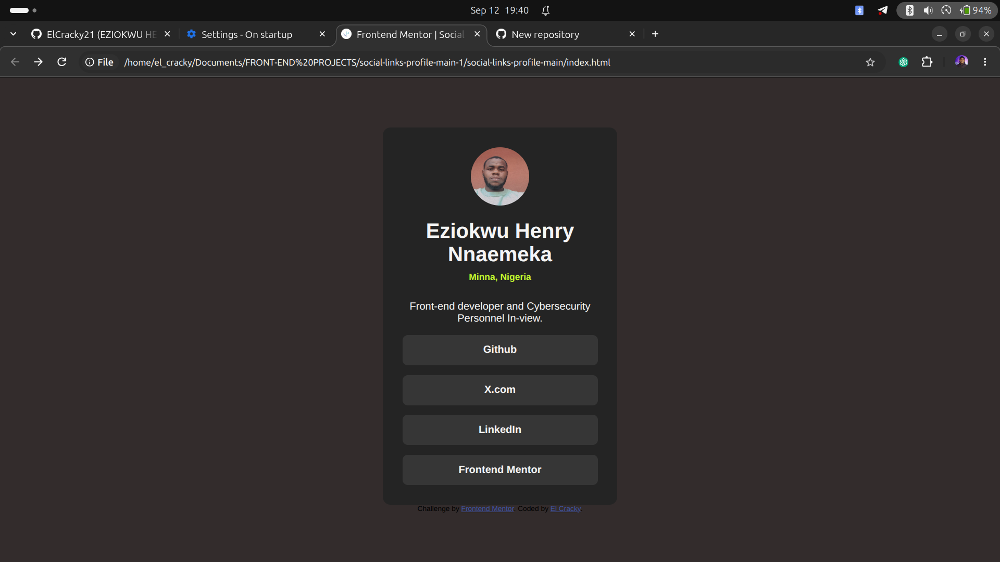

# Frontend Mentor - Social links profile solution

## About The Project
This is a social links profile webpage built as a Frontend Mentor Challenge.
The page contains my profile information and links to my social media and developer platforms.

## Built With
-HTML5
-CSS3
-Flexbox
-Media Queries

## What I Learned
While building this project, I practiced:
- Creating a webpage structure with HTML
- Styling elements with CSS
- Using Flexbox to position and align elements
- Creating hover effects
- Making a webpage responsive with media queries
- Using custom fonts with @font-face
- Working with images and relative file paths
- Using Git and GitHub to manage and publish my project

## Features

- Responsive design
- Hover effects on links
- Custom font
- Profile image
- Social media links

## Links

- GitHub: https://github.com/ElCracky21
- X: https://x.com/eziokwu_henry1
- LinkedIn: https://www.linkedin.com/in/eziokwu-henry-124417284/

## Author

Eziokwu Henry Nnaemeka

Frontend Developer & Cybersecurity Student

## Acknowledgements

This project was built as part of the
[Frontend Mentor](https://www.frontendmentor.io/) Social Links Profile challenge.

